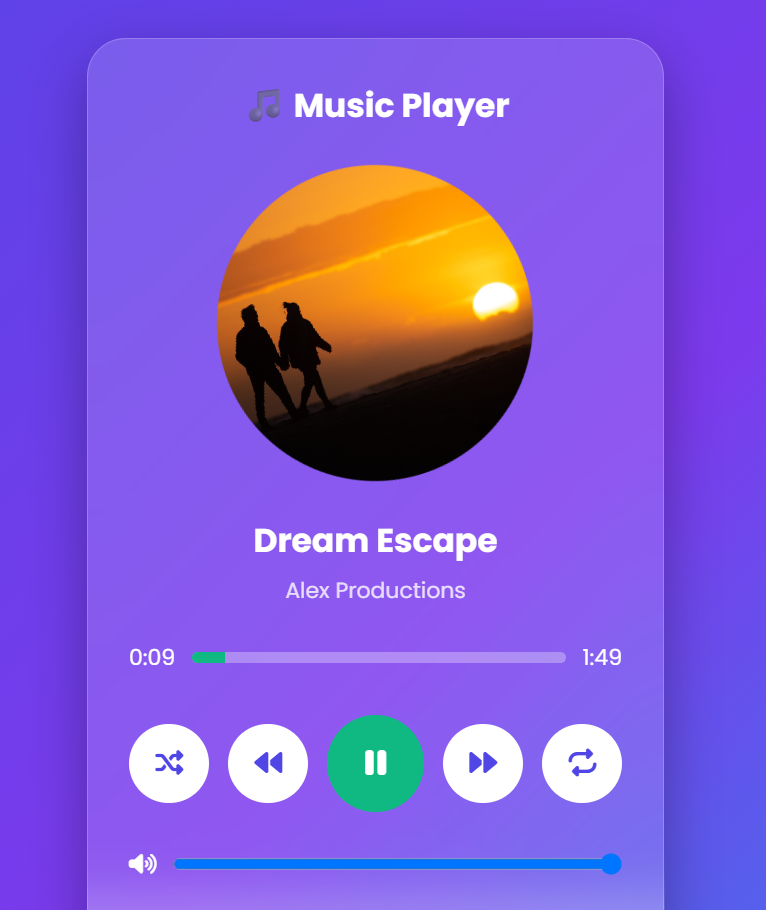
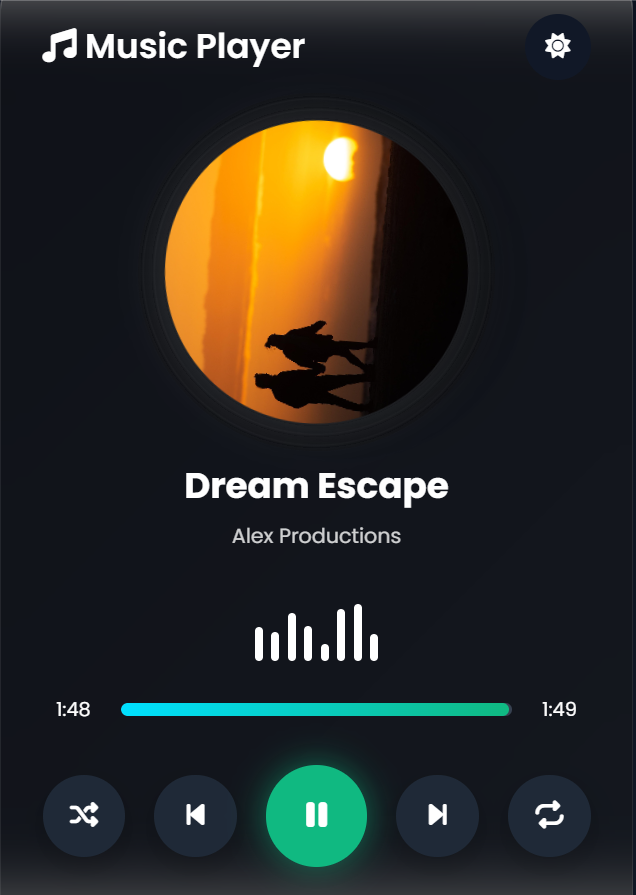
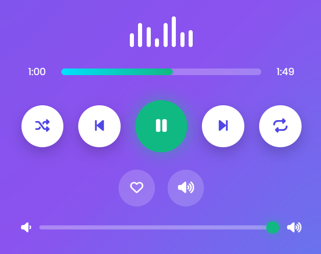
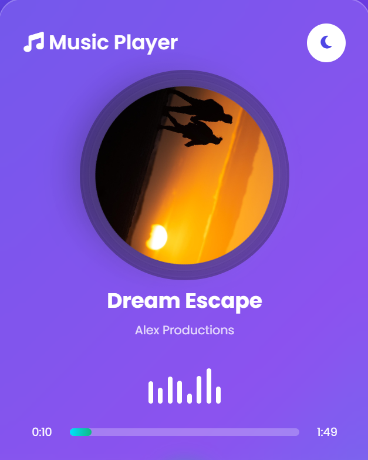
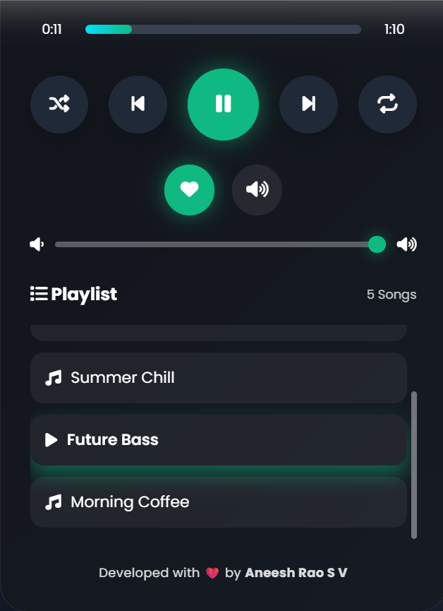
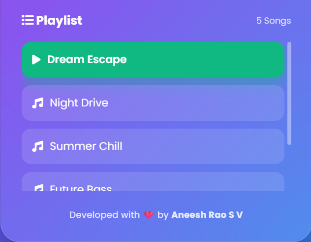

# 🎵 CodeAlpha Music Player

<div align="center">


### 🎧 A Modern Music Player built using HTML, CSS & JavaScript

Developed as **Task 4** for the **CodeAlpha Frontend Development Internship**

</div>

---

# 📖 Project Overview

The **CodeAlpha Music Player** is a modern, responsive, and feature-rich web music player developed using **HTML, CSS, and JavaScript**.

It provides a smooth user experience with elegant animations, responsive layouts, interactive controls, and a beautiful glassmorphism-inspired interface.

The application demonstrates strong knowledge of DOM manipulation, Audio API, Local Storage, event handling, responsive design, and modern UI/UX development.

---

# ✨ Features

## 🎵 Music Controls

- ▶️ Play Music
- ⏸ Pause Music
- ⏮ Previous Song
- ⏭ Next Song

---

## 🎧 Audio Features

- Live Progress Bar
- Seek Functionality
- Volume Control
- Mute / Unmute
- Song Duration
- Current Time Display

---

## 📂 Playlist

- Interactive Playlist
- Active Song Highlight
- One Click Song Selection

---

## 🎨 Modern User Interface

- Beautiful Glassmorphism Design
- Responsive Layout
- Animated Album Art
- Animated Music Visualizer
- Hover Effects
- Smooth Transitions

---

## 🌙 Theme Support

- Light Mode
- Dark Mode
- Theme Memory using Local Storage

---

## ⭐ Additional Features

- ❤️ Favorite Button
- 🔀 Shuffle Songs
- 🔁 Repeat Mode
- ⌨ Keyboard Shortcuts
- 💾 Local Storage Support

---

# 📸 Project Screenshots

## 🖥 Desktop - Light Mode



---

## 🌙 Desktop - Dark Mode



---

## 🎛 Music Controls

Play, Pause, Shuffle, Repeat, Favorite, Volume Control and Progress Bar.



---

## 📱 Mobile View

| Mobile Light                      | Mobile Dark                      |
| --------------------------------- | -------------------------------- |
|  |  |

---

## 📂 Playlist

Interactive playlist with active song highlighting.



---

# ⌨ Keyboard Shortcuts

| Key   | Function        |
| ----- | --------------- |
| Space | Play / Pause    |
| ←     | Previous Song   |
| →     | Next Song       |
| ↑     | Increase Volume |
| ↓     | Decrease Volume |

---

# 🛠 Technologies Used

- HTML5
- CSS3
- JavaScript (ES6)
- Font Awesome
- Google Fonts

---

# 📁 Folder Structure

```
CodeAlpha_MusicPlayer/
│
├── index.html
├── style.css
├── script.js
│
├── music/
│   ├── song1.mp3
│   ├── song2.mp3
│   ├── song3.mp3
│   ├── song4.mp3
│   └── song5.mp3
│
├── images/
│   ├── cover1.jpg
│   ├── cover2.jpg
│   ├── cover3.jpg
│   ├── cover4.jpg
│   └── cover5.jpg
│
├── screenshots/
│   ├── light-mode.png
│   ├── dark-mode.png
│   ├── player-controls.png
│   ├── mobile-light.png
│   ├── mobile-dark.png
│   └── playlist.png
│
└── README.md
```

---

# 🚀 Getting Started

## Clone Repository

```bash
git clone https://github.com/aneeshrao0207/CodeAlpha_MusicPlayer.git
```

---

## Open Project

```bash
cd CodeAlpha_MusicPlayer
```

---

## Run

Simply open

```
index.html
```

inside your browser.

---

# 📚 Learning Outcomes

During this project I improved my understanding of:

- HTML5 Structure
- Modern CSS Layouts
- Responsive Web Design
- CSS Animations
- Glassmorphism UI
- JavaScript DOM Manipulation
- Audio API
- Local Storage
- Event Handling
- User Interface Design
- User Experience Design

---

# 🎯 Internship Details

**Internship:** CodeAlpha Frontend Development Internship

**Domain:** Frontend Development

**Task:** Task 4 – Music Player using JavaScript

---

# 👨‍💻 Developer

## Aneesh Rao S V

Frontend Developer

📧 Passionate about building responsive and interactive web applications using modern web technologies.

---

# ⭐ Support

If you like this project, please consider giving it a **Star ⭐** on GitHub.

It motivates me to build more awesome projects.

---

<div align="center">

## ❤️ Made with Passion by Aneesh Rao S V

</div>
